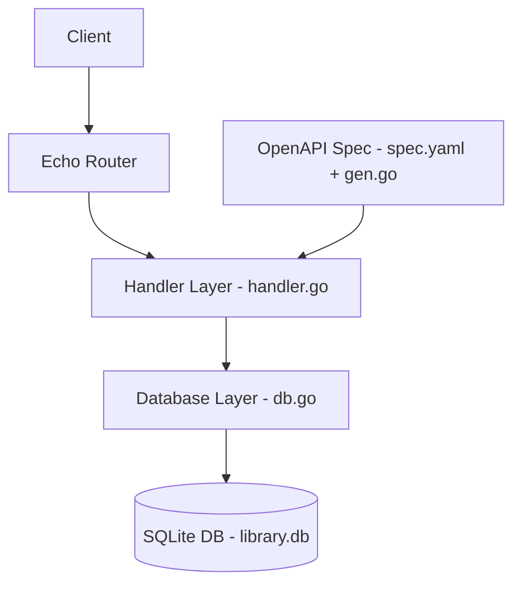

# 📚 Library Archive API

A RESTful API for managing books and authors, built with Go using Echo, GORM, and OpenAPI (oapi-codegen).

---

## 🚀 Features

- CRUD operations for books
- Basic operations for authors
- OpenAPI-driven development
- Clean architecture (api / db / handler)
- SQLite database for local development

---

## 🛠 Tech Stack

- Go
- Echo (web framework)
- GORM (ORM)
- SQLite
- OpenAPI (oapi-codegen)

---

## 🏗 Architecture

---

## 📂 Project Structure

    Library-Archive/
    ├── api/        # Generated OpenAPI models and interfaces
    ├── db/         # Database connection setup
    ├── handler/    # HTTP handlers
    ├── main.go     # Entry point
    ├── spec.yaml   # OpenAPI spec
    └── library.db  # Local DB (ignored)

---

## ▶️ Getting Started

### 1. Clone the repository

    git clone https://github.com/coderfeye13/Library-Archive.git
    cd Library-Archive

### 2. Install dependencies

    go mod tidy

### 3. Run the app

    go run main.go

Server runs at:

    http://localhost:8080

---

## 📬 Example API Usage

### Create Author

    curl -X POST http://localhost:8080/authors \
    -H "Content-Type: application/json" \
    -d '{"name":"George Orwell","bio":"English novelist"}'

---

### Get Authors

    curl http://localhost:8080/authors

---

### Create Book

    curl -X POST http://localhost:8080/books \
    -H "Content-Type: application/json" \
    -d '{"title":"1984","author_id":1,"published_year":1949}'

---

### Get Books

    curl http://localhost:8080/books

---

### Get Book by ID

    curl http://localhost:8080/books/1

---

### Update Book

    curl -X PUT http://localhost:8080/books/1 \
    -H "Content-Type: application/json" \
    -d '{"title":"Animal Farm","author_id":1,"published_year":1945}'

---

### Delete Book

    curl -X DELETE http://localhost:8080/books/1

---

## 📖 API Endpoints

### Books

- GET /books
- POST /books
- GET /books/{id}
- PUT /books/{id}
- DELETE /books/{id}

### Authors

- GET /authors
- POST /authors

---

## 🧠 What I Learned

- Building REST APIs with Go
- Using GORM with SQLite
- Struct & pointer handling
- OpenAPI-driven backend development
- Clean project structuring

---

## ⚠️ Notes

- SQLite database file (library.db) is created automatically
- It is ignored via `.gitignore`
- No external database setup required

---

## 👨‍💻 Author

Furkan Yilmaz  
M.Sc. Computer Science Student @ HAW Kiel  
Software Developer at Baltic Online Computer GmbH

---

## ⭐ Future Improvements

- Swagger UI integration
- Docker support
- Authentication (JWT)
- PostgreSQL support
- Testing (unit & integration)